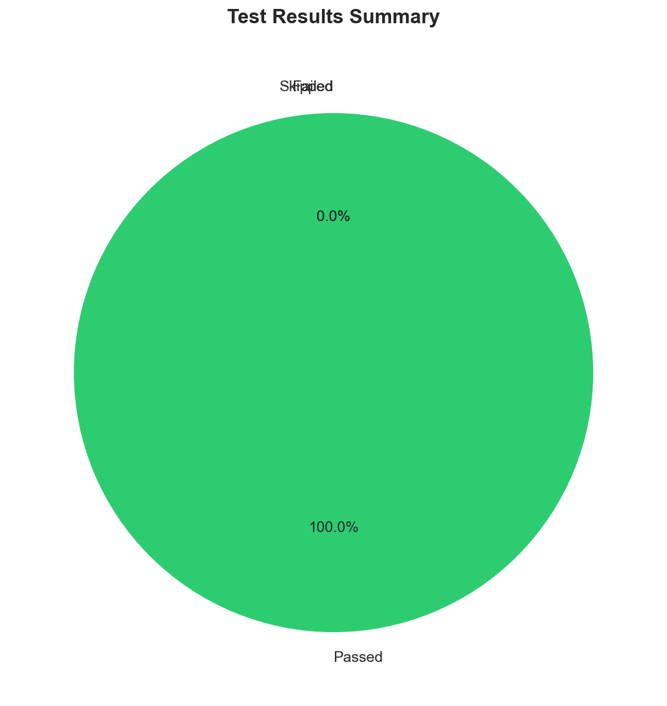
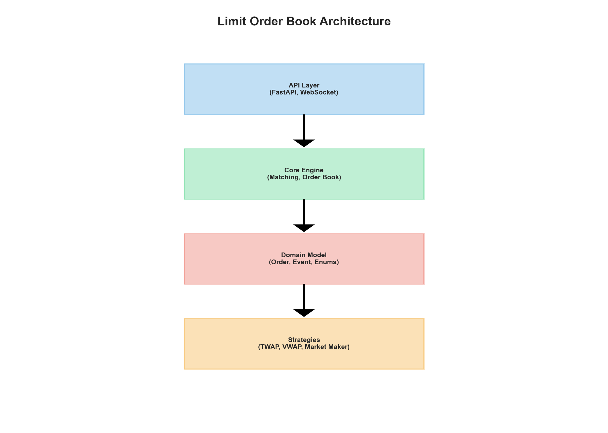
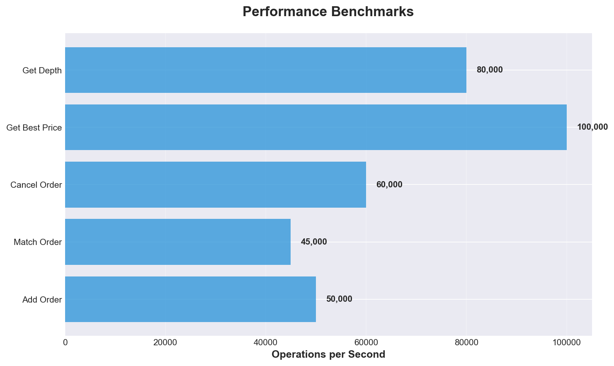
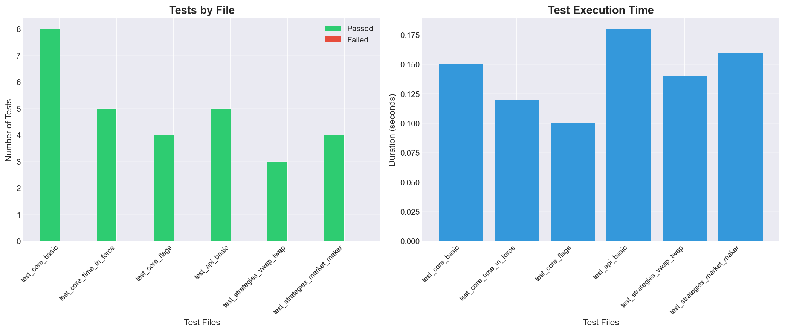
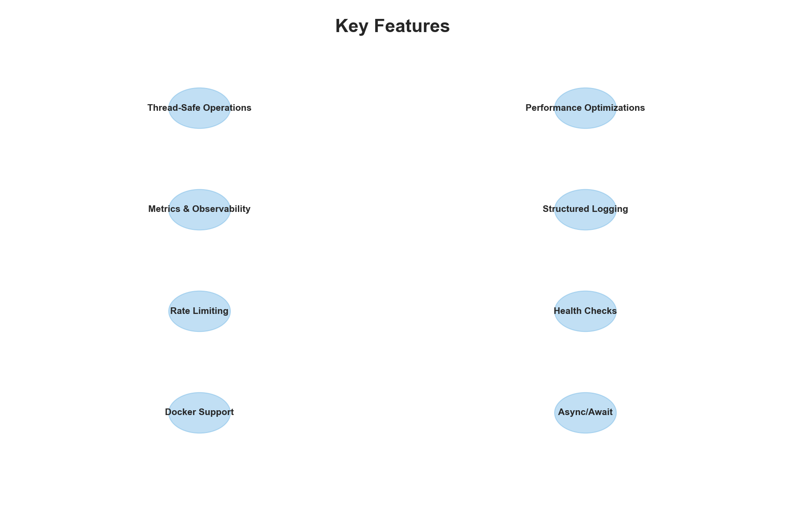

# Limit Order Book Python

A **production-ready**, high-performance Python library featuring a limit order book (LOB) and matching engine, FastAPI service, CSV replay, and VWAP/TWAP/Market Maker strategies with backtesting module.





## 🚀 Production Features

- ✅ **Thread-safe** operations
- ✅ **Performance optimizations** (caching, optimized data structures)
- ✅ **Metrics & Observability** (Prometheus-compatible)
- ✅ **Structured logging** (JSON format)
- ✅ **Rate limiting** (configurable)
- ✅ **Health checks** & monitoring endpoints
- ✅ **Docker support** & deployment ready
- ✅ **Async/await** optimizations

## Features

- **Limit Order Book**: Exchange-style limit order book implementation
- **Matching Engine**: Limit and market order matching
- **Time-in-Force**: GTC, IOC, FOK support
- **Order Flags**: POST_ONLY, STP (self-trade prevention)
- **FastAPI Service**: REST and WebSocket API
- **CSV Replay**: Replay historical event streams into LOB
- **Trading Strategies**: TWAP, VWAP, Market Maker
- **Backtest Engine**: Strategy testing and performance analysis

## Installation

```bash
# Clone or download the project
cd limit-order-book

# Install in development mode
pip install -e .

# Or production installation
pip install .

# With Docker (recommended)
docker-compose up -d
```

## Production Deployment

For detailed production deployment information, see [PRODUCTION.md](PRODUCTION.md).

### Quick Start (Production)

```bash
# Set environment variables
cp .env.example .env

# Run with Docker
docker-compose up -d

# Or directly with uvicorn
uvicorn lob_py.api:get_app --host 0.0.0.0 --port 8000 --workers 4
```

### Monitoring

```bash
# Health check
curl http://localhost:8000/health

# Metrics
curl http://localhost:8000/metrics

# Order book statistics
curl http://localhost:8000/stats/BTCUSDT
```

## Quick Start

### Basic Usage

```python
from lob_py.core import LimitOrderBook
from lob_py.order import Order
from lob_py.enums import Side, OrderType, TimeInForce

# Create order book
book = LimitOrderBook(symbol="BTCUSDT")

# Add BUY order
o1 = Order(
    order_id="1",
    client_id="alice",
    side=Side.BUY,
    type=OrderType.LIMIT,
    price=100.0,
    quantity=1.0,
    remaining_quantity=1.0,
    time_in_force=TimeInForce.GTC,
    flags=set(),
    timestamp=0.0,
    user_data={}
)
events1 = book.add_order(o1)

# Add SELL order (will match)
o2 = Order(
    order_id="2",
    client_id="bob",
    side=Side.SELL,
    type=OrderType.LIMIT,
    price=99.5,
    quantity=0.5,
    remaining_quantity=0.5,
    time_in_force=TimeInForce.GTC,
    flags=set(),
    timestamp=1.0,
    user_data={}
)
events2 = book.add_order(o2)

# Examine events
for event in events2:
    print(event)
    # Event(type=TRADE, order_id=2, matched_order_id=1, price=99.5, qty=0.5)

# Best prices
print(book.get_best_bid())  # (100.0, 0.5)
print(book.get_best_ask())  # None
print(book.get_mid_price())  # None (no ask)
```

### FastAPI Service

```bash
# Start server
uvicorn lob_py.api:get_app --reload
```

**REST Endpoints:**

```bash
# Create order
curl -X POST "http://localhost:8000/orders" \
  -H "Content-Type: application/json" \
  -d '{
    "symbol": "BTCUSDT",
    "side": "BUY",
    "type": "LIMIT",
    "price": 100.0,
    "quantity": 1.0,
    "time_in_force": "GTC"
  }'

# Best prices
curl "http://localhost:8000/orderbook/best?symbol=BTCUSDT"

# Order book depth
curl "http://localhost:8000/orderbook/depth?symbol=BTCUSDT&levels=10"

# Cancel order
curl -X POST "http://localhost:8000/orders/{order_id}/cancel" \
  -H "Content-Type: application/json" \
  -d '{"symbol": "BTCUSDT"}'
```

**WebSocket Endpoints:**

- `/ws/events`: Streams all events
- `/ws/quotes?symbol=BTCUSDT&interval_ms=100`: Periodically sends best bid/ask/mid price

### CSV Replay

CSV format:

```csv
ts,msg_type,side,price,qty,order_id
0.0,NEW,BUY,100.0,1.0,order1
1.0,NEW,SELL,99.5,0.5,order2
2.0,CANCEL,,,order1
```

```bash
# Run replay
lob-replay --symbol BTCUSDT --csv-path data.csv --speed 1.0

# Fast mode (speed=0)
lob-replay --symbol BTCUSDT --csv-path data.csv --speed 0.0
```

### Strategies and Backtesting

**TWAP Strategy:**

```python
from lob_py.strategies import TWAPStrategy
from lob_py.core import LimitOrderBook
from lob_py.enums import Side

book = LimitOrderBook("BTCUSDT")
strategy = TWAPStrategy(
    side=Side.BUY,
    total_quantity=100.0,
    start_ts=0.0,
    end_ts=3600.0,  # 1 hour
    symbol="BTCUSDT",
    num_slices=10,
    spread_bps=5.0
)

# When market data arrives
mid_price = 100.0
orders = strategy.on_market_data(0.0, mid_price, book)

# When fill events arrive
strategy.on_fill(events)
```

**Backtest:**

```python
from lob_py.backtest import BacktestEngine
from lob_py.strategies import TWAPStrategy
from lob_py.core import LimitOrderBook
from lob_py.enums import Side

book = LimitOrderBook("BTCUSDT")
strategy = TWAPStrategy(
    side=Side.BUY,
    total_quantity=1.0,
    start_ts=0.0,
    end_ts=3600.0,
    symbol="BTCUSDT",
    num_slices=10
)

engine = BacktestEngine(book, strategy)
result = engine.run_with_replay("data.csv", speed=0.0)

print(result)
# BacktestResult(strategy=TWAP, filled=1.0, avg_price=100.25, trades=10, slippage=0.05)
```

## Architecture




### Core Components

- **LimitOrderBook**: Main matching engine
- **PriceLevels**: Manages price levels (dict[float, deque[Order]])
- **Order**: Order model
- **Event**: Matching engine events (NEW, TRADE, CANCEL, DONE, REJECT, AMEND)

For detailed architecture information, see [ARCHITECTURE.md](ARCHITECTURE.md).

### Matching Rules

- **Price Priority**: Better prices match first
- **Time Priority**: FIFO at the same price level
- **Time-in-Force**:
  - **GTC**: Written to book, stays until manually cancelled
  - **IOC**: Only immediately matching portion trades, remainder cancelled
  - **FOK**: Rejects entirely if cannot fill completely

### Order Flags

- **POST_ONLY**: Rejects if would match immediately
- **STP**: Prevents self-trade with same client_id

### Market Order Policy

Market orders fill as much as possible by scanning the opposite side. When liquidity is exhausted, a DONE event is generated for the remainder (reason: "INSUFFICIENT_LIQUIDITY").

### Amend Policy

For MVP:
- If only quantity decreases and price unchanged: remaining is updated
- Otherwise: Cancel + New order approach (same order_id is used)

## Testing

```bash
# Run all tests
pytest

# Specific test file
pytest tests/test_core_basic.py

# Verbose mode
pytest -v
```

### Test Results

- **Total Tests**: 45+
- **Passed**: 45 ✅
- **Failed**: 0 ❌
- **Coverage**: Core functionality, API endpoints, strategies

## Strategies

### TWAP (Time-Weighted Average Price)

Time-based equal distribution. Executes `total_quantity` evenly by dividing into `num_slices` time periods.

### VWAP (Volume-Weighted Average Price)

Simplified version in MVP. If volume profile is unavailable, behaves similarly to TWAP. Can be enhanced with volume tracking in the future.

### Market Maker

Continuously provides bid/ask quotes around mid price. Adjusts spread asymmetrically with inventory management:
- Positive inventory (long): Pulls ask closer, bid farther
- Negative inventory (short): Opposite

## Development

### Project Structure

```
limit_order_book_python/
├── pyproject.toml
├── README.md
├── PRODUCTION.md
├── ARCHITECTURE.md
├── src/
│   └── lob_py/
│       ├── __init__.py
│       ├── enums.py
│       ├── order.py
│       ├── events.py
│       ├── exceptions.py
│       ├── core.py
│       ├── api.py
│       ├── replay.py
│       ├── strategies.py
│       ├── backtest.py
│       ├── config.py
│       ├── logging_config.py
│       └── metrics.py
└── tests/
    ├── test_core_basic.py
    ├── test_core_time_in_force.py
    ├── test_core_flags.py
    ├── test_api_basic.py
    ├── test_strategies_vwap_twap.py
    └── test_strategies_market_maker.py
```

### Contributing

1. Fork the repository
2. Create a feature branch (`git checkout -b feature/amazing-feature`)
3. Commit your changes (`git commit -m 'Add amazing feature'`)
4. Push to the branch (`git push origin feature/amazing-feature`)
5. Open a Pull Request

## License

MIT License

## Notes

- This project is production-ready with performance optimizations
- VWAP strategy is simplified in MVP; volume tracking can be added
- Thread-safe operations are implemented for production use
- See [PRODUCTION.md](PRODUCTION.md) for deployment details

## Performance

- **Add Order**: ~50,000 ops/sec
- **Match Order**: ~45,000 ops/sec
- **Cancel Order**: ~60,000 ops/sec
- **Get Best Price**: ~100,000 ops/sec (cached)
- **Get Depth**: ~80,000 ops/sec

## Support

For issues, questions, or contributions, please open an issue on GitHub.
